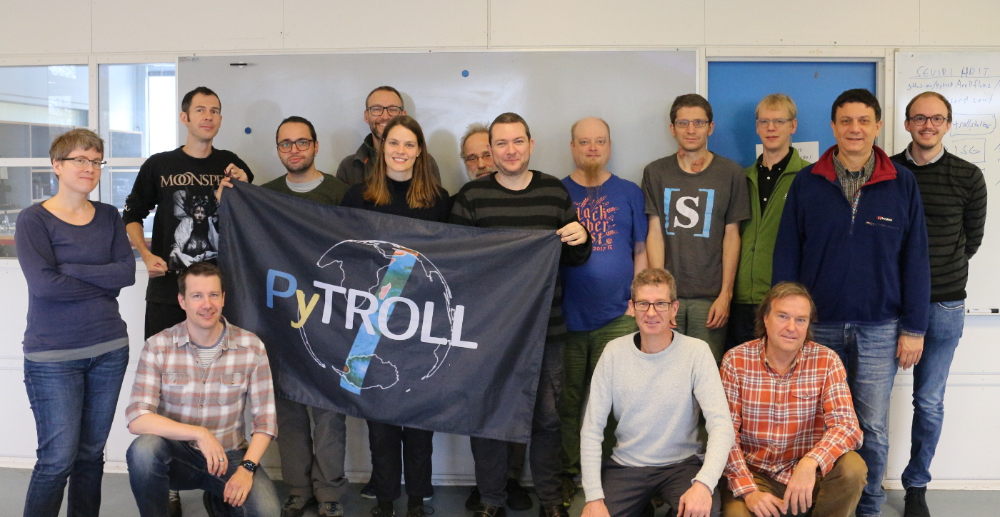

Pytroll is an easy to use, modular, free and open source python framework for the processing of earth observation satellite data. The provided python packages are designed to be used both in R&D environments and in 24/7 operational production.

The focus is on atmospheric applications and imaging sensors, but as seen from the list of supported satellite sensors below the data that can be handled by Pytroll allows the usage in a wide range of earth sciences.

## Pytroll packages and supported data

You can find the complete list of pytroll packages on github.com: <https://github.com/pytroll>.
Also checkout this [overview description](pytroll_packages_overview.md) of all packages and their mutual 
dependencies, maturity and known operational usage.

A non exhaustive list of supported satellites and formats is provided here: <http://satpy.readthedocs.io/en/latest/>

## Tutorials, examples...

For a quick and easy overview of what Pytroll can possibly offer for you have a look at the [Pytroll overview](https://docs.google.com/presentation/d/10QSq6H0QL4WruEiY-1TU4Rk-f05QzZOZ1UoD9adx9ow/edit?usp=sharing) which was shown at the 2017 Eumetsat conference in Rome Tuesday October 3rd.

For some pytroll examples, you can have a look at the [Pytroll Gallery](gallery.md) or head directly to <https://nbviewer.jupyter.org/github/pytroll/pytroll-examples>

## Getting in touch

If you want to contact us, we will be very happy to chat with you on the [Pytroll slack](https://pytroll.slack.com).
To get access you must invite yourself to the slack team by clicking on the
above badge image or go [here](https://pytrollslackin.herokuapp.com/). This
invite page can sometimes take a while to load so please be patient.
You can see past conversations by
[looking at the archives](https://pytroll.slackarchive.io).

Alternatively, you can send messages mailing list: <https://groups.google.com/group/pytroll>.

## Announcements

December 4th, 2019 was the [10 year anniversary of Pytroll](https://youtu.be/RgGiDypQrMQ)

The next Pytroll Contributor Week (PCW) is
tentatively scheduled for spring 2020 (likely May) in Norrköping, Sweden. We
will come back later when location and dates have been decided.

## Pytroll Contributor Weeks (PCWs)

The PCW is a gathering of the developers and users of Pytroll during which they
address issues and new features in the project and work/code together. It is
usually conducted as a hackaton type of event during one week in some of the
instutions already contributing to Pytroll. It is a great opportunity to learn
more about Pytroll and get involved in the development. Some experience with
Python is desirable to enjoy the PCW at its full potential :) Due to the format
of the PCW meeting it is not necessary to attend all 5 days. It is perfectly
acceptable to come to a PCW and spend the time learning how to use Pytroll
tools in your own workflow.

Any questions can be asked on the mailing list or on pytroll.slack.com (see
"Getting in touch" above).

### Past PCWs

The most recent Pytroll Contributor Week took place at the DMI headquarters in
Copenhagen, Denmark, from November 25th till 29th, 2019. The Copenhagen PCW was
particularly special since it was taking place almost exactly 10 years since
Pytroll was started, then as a bilateral cooperation between the Danish and
Swedish Met services. This time we were 18 people attending, almost all of us
during the entire week, coming from Poland, Germany, Switzerland, Sweden,
Denmark and Italy, representing 8 different entities (National Met services,
EUMETSAT, Tecnavia (Swiss company), and other governmental/environmental
institutes). We had a mixture of a few first time attendees to those who have
been attending regularly the last few years.

For a summary of achievements in the last PCW and to see other workshops look
at the [Workshops](./workshops/index.md) page.

## Code of Conduct

All Pytroll projects and events follow a code of conduct. A link to the code
of conduct can be found in the section below. It is also available in the
[CODE_OF_CONDUCT.md](CODE_OF_CONDUCT.md) file in the Pytroll package source
repositories.

This code of conduct applies to the
project space (GitHub) as well as the public space online and offline when
an individual is representing the project or the community. Online examples
of this include the Pytroll Slack team, mailing list, and the Pytroll twitter
account. This code of conduct also applies to in-person situations like
Pytroll Contributor Weeks (PCW), conference meet-ups, or any other time when
the project is being represented.

Any violations of this code of conduct will be handled by the core maintainers
of the project including David Hoese, Martin Raspaud, and Adam Dybbroe.
If you wish to report one of the maintainers for a violation and are
not comfortable with them seeing it, please contact one or more of the other
maintainers to report the violation. Responses to violations will be
determined by the maintainers and may include one or more of the following:

- Verbal warning
- Ask for public apology
- Temporary or permanent ban from in-person events
- Temporary or permanent ban from online communication (Slack, mailing list, etc)

## Links

- [SatPy introduction at SciPy 2018, by David Hoese](https://www.youtube.com/watch?v=G-fz8L9xHIs)
- [Pytroll Contributors Weeks](workshops/index.md)
- [Pytroll Coding Guidelines and Best Practices](guidelines.md)
- [Pytroll Manifest](manifest.md)
- [Memorandum of Understanding](pytroll_mou_20170222.pdf)
- [Pytroll Shop](http://pytroll.spreadshirt.net/)
- [Pytroll History SatPy](https://youtu.be/eBQi2G_fqXQ)
- [Code of Conduct](CODE_OF_CONDUCT.md)
- [Logos](logos/index.md)
